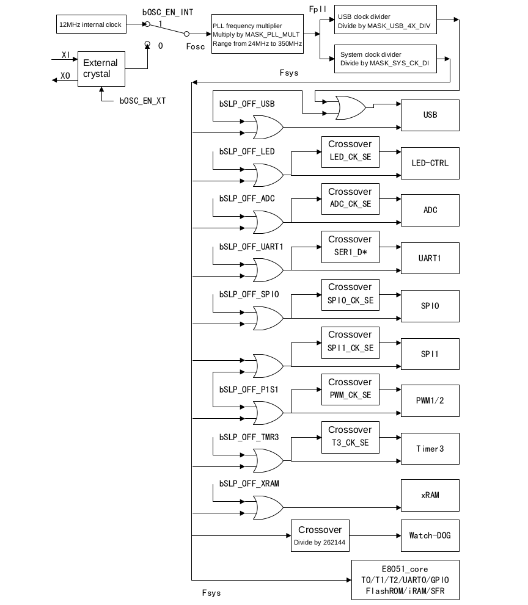

# 8. System Clock

## 8.1 Clock Block Diagram

    
Figure 8.1.1 Clock system and structure

The internal clock or external clock is selected as the original clock Fosc, and then the PLL is multiplied to generate the Fpll high-frequency clock. Finally, two sets of frequency converters are used to obtain the system clock Fsys and the clock of the USB module Fusb4x.

The system clock Fsys is provided to each module of the CH559 directly or after clock gating. Each module does not need to work at the same time. In order to reduce power consumption, the clock of modules that do not need to work can be disabled by setting the sleep control register.

## 8.2 Register description

    
Table 8.2.1 Clock control register list

<table>
    <tr>
        <th>Name</th><th>Address</th><th>Description</th><th>Reset value</th>
    </tr>
    <tr><td>CLOCK_CFG</td><td>B3h</td><td>System clock configuration register</td><td>98h</td></tr>
    <tr><td>PLL_CFG</td><td>B2h</td><td>PLL clock configuration register</td><td>D8h</td></tr>
</table>

### System clock configuration register (CLOCK_CFG), writable only in safe mode:

<table>
    <tr>
        <th>Bit</th><th>Name</th><th>Access</th><th>Description</th><th>Reset value</th>
    </tr>
    <tr><td>7</td><td>bOSC_EN_INT</td><td>RW</td><td>Internal clock oscillator enable, this bit is 1 to enable the internal clock oscillator and select the internal clock; this bit is 0 to disable the internal clock oscillator and select an external crystal oscillator</td><td>1</td></tr>
    <tr><td>6</td><td>bOSC_EN_XT</td><td>RW</td><td>External crystal oscillator is enabled. If this bit is 1, the P4.6 / P4.7 pins are used as XI / XO and the oscillator is enabled. An external quartz crystal or ceramic oscillator is required between XI and XO; this bit is 0. Off External oscillator</td><td>0</td></tr>
    <tr><td>5</td><td>bWDOG_IF_TO</td><td>R0</td><td>Watchdog timer interrupt flag bit. When this bit is 1, it indicates that there is an interrupt, which is triggered by the timer overflow signal. When this bit is 0, it indicates that there is no interrupt. This bit is automatically cleared when the watchdog count register WDOG_COUNT is reloaded or after entering the corresponding interrupt service routine</td><td>0</td></tr>
    <tr><td>[4:0]</td><td>MASK_SYS_CK_DIV</td><td>RW</td><td>System clock division factor, when the value is 00000b, it means 100000b</td><td>11000b</td></tr>
</table>

### PLL clock configuration register (PLL_CFG), writable only in safe mode:

<table>
    <tr>
        <th>Bit</th><th>Name</th><th>Access</th><th>Description</th><th>Reset value</th>
    </tr>
    <tr><td>[7:5]</td><td>MASK_USB_4X_DIV</td><td>RW</td><td>USB clock division factor, when the value is 000b, it means 1000b</td><td>110b</td></tr>
    <tr><td>[4:0]</td><td>MASK_PLL_MULT</td><td>RW</td><td>PLL reference clock multiplier</td><td>11000b</td></tr>

</table>

## 8.3 Clock configuration

The CH559 chip uses the internal clock by default after power-on. The internal clock frequency is 12MHz. The internal clock or external crystal oscillator clock can be selected by CLOCK_CFG. If the external crystal oscillator is turned off, the XI and XO pins can be used as P4.6 and P4.7 ordinary I / O ports.

If an external crystal oscillator is used to provide the clock, then the crystal should be connected between the XI and XO pins, and the oscillating capacitor should be connected to the XI and XO pins respectively to GND; if the clock signal is input directly from the outside, Pin input, XO pin floating.

+ Original clock frequency Fosc = bOSC_EN_INT? 12MHz: Fxt
+ PLL frequency Fpll = Fosc * (PLL_CFG & MASK_PLL_MULT)
+ USB clock division factor Kusb = (PLL_CFG & MASK_USB_4X_DIV) >> 5
+ USB clock frequency Fusb4x = Fpll / (Kusb? Kusb: 8)
+ System clock division factor Ksys = CLOCK_CFG & MASK_SYS_CK_DIV
+ System frequency Fsys = Fpll / (Ksys? Ksys: 32)
+ After reset, Fosc = 12MHz, Fpll = 288MHz, Fusb4x = 48MHz, Fsys = 12MHz.

### To switch to an external crystal oscillator to provide the clock:

1. Enter safe mode, step one SAFE_MOD = 55h; step two SAFE_MOD = AAh.
2. Set "bOSC_EN_XT" in CLOCK_CFG by "bit-or" operation, other bits remain unchanged, enable crystal oscillator.
3. Delay of several milliseconds, usually 5mS ~ 10mS, waiting for the crystal oscillator to work stably.
4. Enter the safe mode again, step one SAFE_MOD = 55h; step two SAFE_MOD = AAh.
5. Clear the bOSC_EN_INT in CLOCK_CFG to 0 with the "bit and" operation, the other bits remain unchanged, and switch to the external clock.
6. Close the safe mode, and write any value to SAFE_MOD to terminate the safe mode in advance.

### The steps to modify the system clock are as follows:

1. Calculate the new values of PLL_CFG and CLOCK_CFG in advance to avoid the calculation process too long beyond the validity period of the safe mode.
2. Enter the safe mode, step one SAFE_MOD = 55h; step two SAFE_MOD = AAh.
3. Write new value to PLL_CFG.
4. Write a new value to CLOCK_CFG.
5. Close the safe mode, and write any value to SAFE_MOD to terminate the safe mode in advance.

### Remarks:

1. PLL frequency Fpll is recommended not to exceed the frequency range of 24MHz ~ 350MHz.
2. Prioritize the use of a lower system clock frequency Fsys, thereby reducing system dynamic power consumption and widening the operating temperature range.
3. If the USB module is used, Fusb4x must be adjusted to 48MHz.
4. Switching the external crystal and modifying the main frequency of the system are two independent operations. If both are required at the same time, it is recommended to divide into two cases:
    1. if the external crystal frequency does not exceed 13MHz, then switch to the external crystal first, and then modify the system main frequency.
    2. If the external crystal frequency is greater than 13MHz, first reduce the PLL reference clock multiplication factor in the PLL_CFG register to avoid the PLL frequency Fpll overflow, then switch to the external crystal, and finally modify the system main frequency, or you can also modify the PLL_CFG At the same time modify the system clock.